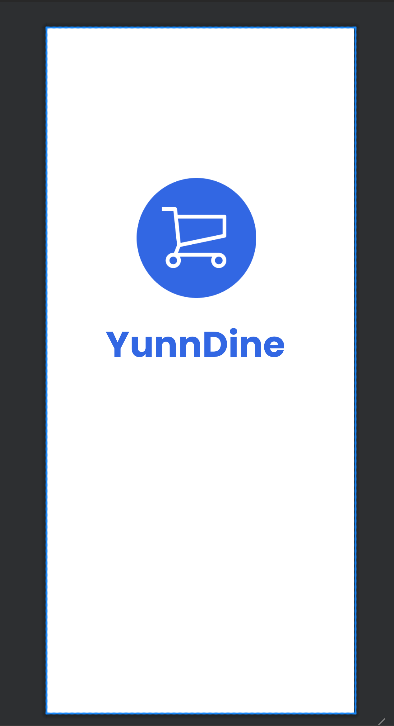
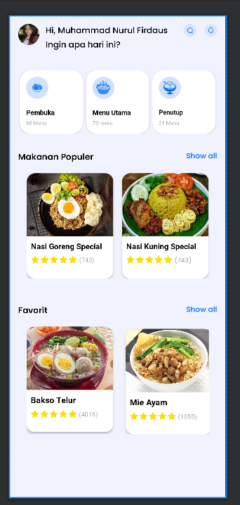
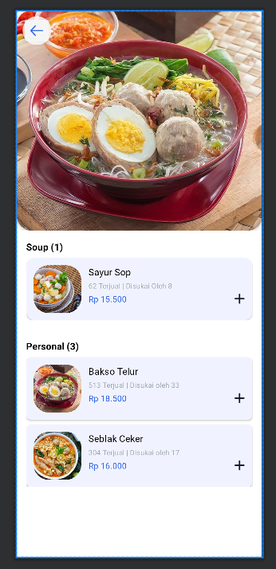
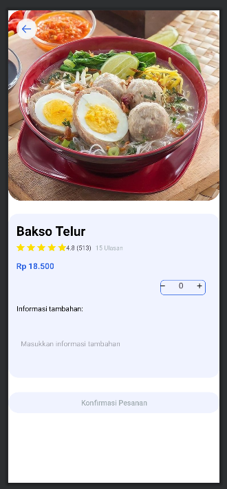
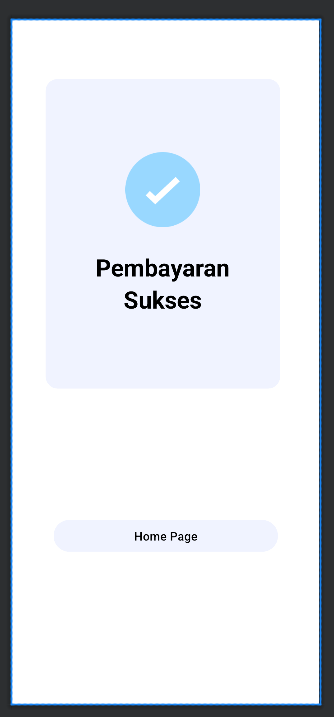

# Project UTS { Semester 3 } 

## Profil
|  |  |
| -------- | --- |
| **Nama** | Muhammad Nurul Firdaus |
| **Kelas** | TI.23.A5 |
| **Mata Kuliah** | Pemrograman Mobile 1 |

# YunnDine

## Definisi YunnDine
**YunnDine** adalah aplikasi pemesanan makanan modern yang dirancang untuk memberikan pengalaman pemesanan yang cepat, mudah, dan nyaman. Dengan nama yang menggabungkan keunikan personal dan konsep makan malam, YunnDine menawarkan berbagai pilihan menu dari restoran favorit Anda, disertai dengan fitur antarmuka yang ramah pengguna dan layanan yang terpercaya. Aplikasi ini bertujuan untuk menyederhanakan proses pemesanan makanan, memastikan kualitas pelayanan terbaik, dan menghadirkan kemudahan menikmati hidangan lezat kapan saja dan di mana saja.

## Output

***Keterangan :***

- Berikut adalah tampilan awal apabila ``telah berhasil di RUN`` di awali dengan Logo dan nama aplikasi **YunnDine**.

## Output

***Keterangan :***

- Selanjutnya, setelah menunggu selama kurang lebih 2 detik, ``maka akan menampilkan Home Page YunnDine dan beberapa menu serta pilihan jenis makanan(Pembuka, Menu Utama, dan Penutup)``

## Output 

***Keterangan :***

- Selanjutnya, bisa langsung ``klik tombol menu Utama``. Maka, tampilannya akan berubah untuk melihat ke makanan yang ada pada Menu Utama.

## Output

***Keterangan :***

- Selanjutnya, apabila ``klik menu Bakso Telur``. Maka, tampilannya akan berubah untuk masuk ke detail produknya.

## Output

***Keterangan :***

- Selanjutnya, masuk tahap **Konfirmasi pembelian sukses** jika kita ``klik tombol button Konfirmasi Pesanan,`` maka akan muncul tampilan teks **"Pembayaran Sukses"**.
Kita juga bisa kembali ke **Home Page** dengan mengklik button **Home Page**.

## SELESAI  